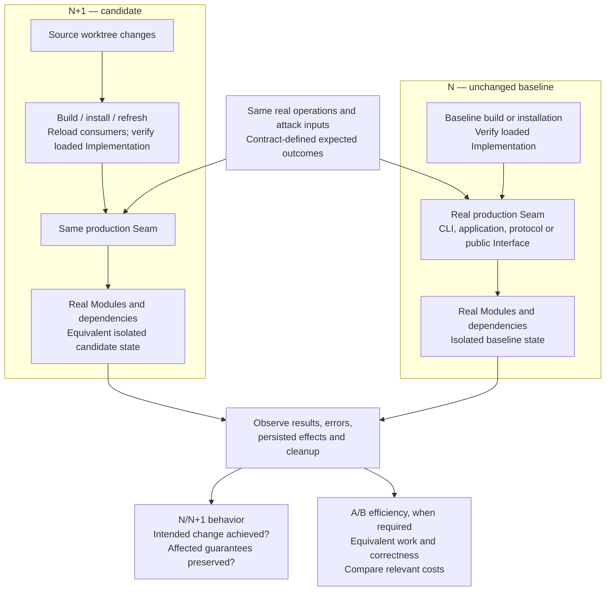
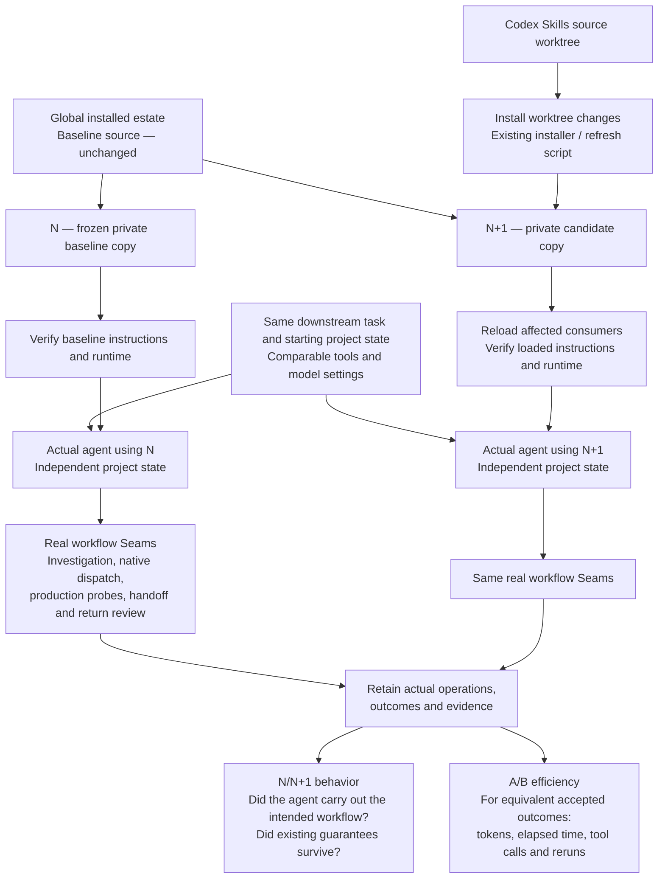

# Real probes: N/N+1 behavior and A/B efficiency

**N is the unchanged baseline. N+1 is the candidate containing the intended change.**
Run equivalent real operations against both, using isolated mutable state and
verified loaded Implementations. N+1 is a version label, not a sample count.

**N/N+1 establishes behavior. A/B compares its cost at equivalent work and
correctness.** The same operations can supply both kinds of evidence.

This guide illustrates the existing
[comparison rules](../skills/production-code/SKILL.md#minimum-implementation-decision)
and [execution setup](../skills/repo-production-workflow/SKILL.md#baseline-and-candidate-execution).
It adds no workflow stage. Mermaid diagrams render on GitHub.

## Downstream projects using Repo Production Workflow

Start with the requested behavior. Investigate affected callers, callees, shared
state and failure paths to choose operations capable of exposing the wrong behavior.
The Interface is the test surface; exercise the real Seam that owns the claim.

1. Keep N unchanged; refresh N+1 from the worktree as changes develop.
2. Run equivalent operations from equivalent starting conditions. Isolate mutable
   dependencies too, so one execution cannot contaminate the other.
3. Compare observations with the intended contract. Agreement alone is insufficient:
   both versions could be wrong. Preservation probes may correctly pass on both.
4. When efficiency matters, compare relevant costs such as elapsed time, allocation
   or I/O. A cheaper run that skips required work is not an improvement.
5. Retain the real probe as regression coverage where practical. Reuse applicable
   evidence; rerun for changed behavior or bindings, unreliable evidence or gaps.

A CLI-routing claim requires the actual CLI. An internal function call cannot
establish that routing works. Pytest, unittest and standalone commands can all drive
real probes; the executed path and observed outcomes determine what they prove.

## Agents editing Codex Skills

The source worktree and the installed estate are different things. Editing a skill
or hook in Git does not establish that an agent is using it. Install changes into
the private candidate estate, then reload affected consumers and verify the binding.

Private estates isolate installed skills, hooks and workflow state. Separate project
state prevents cross-contamination. Bubblewrap can enforce filesystem isolation;
it does not prove which Implementation ran. Refreshing files and verifying the
loaded consumer are separate responsibilities. The Codex Skills README remains
source-project guidance, not part of the installed estate.

Runtime probes establish capabilities such as native review dispatch or evidence
retention. Instruction changes also require observing the actual agent choosing
and carrying out the intended behavior during real work and return review. A
scripted demonstration of recorder commands cannot establish that choice.

## Read the evidence correctly

| Question | Evidence |
|---|---|
| Did the intended behavior change? | N exposes the missing or wrong behavior; N+1 meets the intended contract. For preservation, both may pass. |
| Were affected guarantees preserved? | Real operations cover material success, failure, state and interaction guarantees the change can alter. |
| Is the regression probe sensitive? | The retained check detects the claimed defect. An applicable N failure can establish this; a disposable defect injection establishes sensitivity, not historical N behavior. |
| Is N+1 more efficient? | Comparable costs at equivalent work and correctness, with enough repetition to distinguish improvement from noise. For agents, distinguish cached input, uncached input and output tokens. |
| Is the Implementation minimal? | Investigation and review of the responsible Modules and unnecessary mechanisms. Passing probes alone cannot establish minimality. |

A green runner, CI check or recorder status proves no more than the operations it
actually observed. Missing material acceptance stays unresolved. Keep comparisons
bounded to the task and reuse the same operations instead of creating a second test
path or replaying proof for a new reviewer.
