# Production workflow map

The maintained boundary is workflow sequencing and completion. Git remains an
ordinary delivery tool.

```mermaid
flowchart LR
    B[begin] --> R[Repo Context Forge records the packet graph evidence]
    R --> D{bug or regression?}
    D -->|yes| DG[diagnose]
    D -->|no| A1[advisor preflight]
    DG --> A1
    A1 --> P[production preflight records the Behavior Map]
    P --> M{map has a pending item?}
    M -->|yes| TR[mapped contract RED, preservation items settled first]
    M -->|no: every item already-satisfied or omitted| NR[tdd --not-required]
    TR --> I[implementation]
    NR --> I
    I -->|every contract RED| TG[mapped GREEN]
    I -->|not-required map| V
    TG --> TM[map update when a proof exposes a new obligation]
    TM -->|new obligation| TR
    TM -->|map resolved| V[verification]
    V --> CR[code-review delegate review when non-trivial]
    CR --> A2[final Codex Advisor review]
    A2 --> C{context matched and effective findings terminal?}
    C -->|context mismatch| A2
    C -->|behavioral correction| TM2[tdd-map adds the item]
    TM2 --> TR
    C -->|non-behavioral correction| I
    C -->|evidence-backed rejection| AP[one appeal on the same session]
    AP --> C
    C -->|yes, PR| DL[delivery]
    C -->|yes, no PR| WC[workflow complete]
    DL --> PR{reviewer gate closed?}
    PR -->|yes| WC
    PR -->|behavioral correction| TM2
    PR -->|non-behavioral correction| I
```



## State Interface

One repository-scoped SQLite ledger records accepted transitions as receipts (their evidence and manifest links), logical evidence, review manifests, and each workflow's current state on its workflow row. Behavior Map items and run rows are stored once as content-addressed parts, so an evidence id keeps its original meaning after later map changes. See [Workflow state root](https://github.com/future3OOO/claude-skills/blob/main/README.md#workflow-state-root) for which root holds it.

```text
workflow begin                 # assigns and activates a random workflowId
workflow status|summary        # active canonical state
workflow history               # ordered accepted receipts and logical references
workflow evidence [--full]     # one evidence record's metadata, or its document
workflow set-phase             # trivial code review only
workflow record <kind> [--check] [--input -|path]
                               # preflight|review|advisor-result|advisor-disposition|tdd-map;
                               # `record <kind> --help` prints the accepted shape
workflow tdd                   # mapped RED/GREEN or records not-required
workflow verify                # generic commands, typed quality gate, --observed, --from-evidence
workflow pause|checkpoint|complete|prune
```

Mutation receipts carry only `workflowId`, `slug`, `phase` and `nextAction`;
`status` returns full state. Identity defaults to the active workflow; an explicit
`--slug`/`--workflow-id` that disagrees refuses. Every refusal names all of a
document's violations at once and mutates nothing.

A documentation-only pull request takes the CI job's cheap lane, decided by
`.github/scripts/pr_scope.py` from the pull-request delta and governed by step 9.

### `workflow status` contract

`workflow status` is a public JSON Interface, not a dump of persistence internals.
It returns the active canonical `schemaVersion: 1` projection. Callers may rely
on the semantic workflow fields: repository identity, `slug`, `workflowId`,
`phase`, `nextAction`, phase statuses, advisor/review records, logical evidence
identities, and the optional `paused` and `revalidation` state. The projection
never includes a database path, SQLite table or column name, journal detail, or
other storage mechanism. With no authoritative workflow it prints no JSON,
returns exit 2, names `no active workflow`, and creates no state.

Repo Context Forge, preflight, TDD, verification, review, and
addressed advisor dispositions record only with their native validated documents
as logical evidence, inserted in the same SQLite transaction as the accepted event; a
findings-none advisor disposition intentionally carries no document, and a
refusal names the missing evidence and mutates nothing. The preflight document
owns the initial Behavior Map; mapped TDD evidence carries its stable IDs,
RED/GREEN runs and current dispositions. A plan may show
the map but is not an evidence owner.

Exit 2 alone does not prove a refusal: the verification, TDD, and review
producers each document a path that commits first and returns 2 after — a
command that failed after being recorded, an invalid TDD run recorded as
`reopen` or `in-progress`, and a review whose material findings remain
unresolved. Repo Context Forge, preflight, and verification keep their
accepted reference only while producer-recorded as passed — every other transition drops
it, so a bare replay can never resurrect prior evidence. TDD and code review
instead keep a current producer reference across their own non-passed states —
TDD while in-progress and when not-required, code review while pending — so a
later run can validate or supersede it. Only TDD's in-progress reference serves
GREEN's validation of the RED it follows. TDD entry demands recorded preflight
evidence and, for new governed passes, a mapped behavior ID. Each producer stamps
the workflow instance into its evidence and the ledger keeps its logical
identity, so a passed Repo Context Forge, preflight, or
verification phase without one — legacy state, or a bare library claim — reads
pending at completion, never success. Evidence proves the output exists, not
that the analysis is good; fabrication remains deception and stays covered by
the transcript audit.

The database and its containing directory are private and agent-writable. Committed transactions provide continuity across process restart and compaction; it is not tamper-proof and does not authorize Git. A normal
commit or HEAD change does not invalidate it. The edit hook advises, never
refuses (hook table below). Every RED-phase run records the production paths
changed since the pass began, so a late RED or baseline is labelled in
`summary` and shown to the final review; nothing refuses on it. A `tdd-map`
update is needed only when a GREEN exposes a new obligation. A normally
completed workflow is terminal: every mutation except `begin` is rejected.

After a successful production edit in an active pass, the PostToolUse edit
hook runs one GitNexus `detect-changes` against the pass-start index and names
in its `additionalContext` the impacted tests the current map's recorded
selections do not own, or a short gap when that cannot be decided against this
pass's index. Complete ownership is silent, an identical result repeats neither
notice nor write, a completed or revalidating pass gets no scan, and the
advisory never changes the edit's outcome or the workflow state; a mapped GREEN
issues no second scan. It is advisory and incomplete by nature, and full-map
reconciliation stays the completeness authority. The installed
automatic advisory replaces the manual pre-commit detect-changes step.

A governance-document edit after completion is the sole controlled revalidation exception: it opens a window in
which only verification, code review, the final advisor review, and completion
are accepted, production editing stays closed, and completing again restores
the terminal state. The read-only `checkpoint` query reports consult
readiness for the advisor phases without mutating anything.

`complete` requires every step in the step table (`STEPS` in
`hooks/lib/workflow_state.py`, the one source for sequence, readiness, blockers and
completion) with its producer evidence, a closed Behavior Map judged inside the
transaction, dispositioned material findings, a context-matched final review whose
effective findings are terminal, and an unchanged reviewable tree since the lead review.

## Edit invalidation

```text
production Edit/Write/apply_patch
  -> verification = pending
  -> codeReview = pending
  -> finalReview = pending
  -> nextAction = implementation when a resolved map was touched,
                  otherwise implementation/correction
```

Invalidation occurs before quality feedback, so a failing quality check cannot
leave stale readiness behind. Ordinary documentation and scratch edits are
exempt; governance docs reset verification, code review, and final review, and
resume at the first unsatisfied phase in the same ordered workflow. A
governance-first pass therefore returns to TDD, while a completed
implementation returns to verification.

Behavioral findings from the `code-review` delegate or final Codex Advisor and pushed-head reviewers within the active task return to mapped TDD under the same `workflowId`: add the Behavior Map item, drive its behavior-specific RED, then fix it. Only genuinely non-behavioral corrections return directly to implementation, with the reason recorded. The behavioral/non-behavioral classification is a lead-owned obligation, not a machine-validated edge: the recorder validates the reassessment's structure and blocks completion until one is recorded, but it cannot judge the classification itself - a behavioral defect routed through a why-only reassessment is a doctrine violation the reviews are expected to catch, not a state the hooks can refuse. Separate work outside the active task starts a new workflow with `begin`.

A finding envelope is one correction batch. A pending behavioral finding rides
the pass as a map-owned attack obligation; dispositions may cover any subset,
and later documents preserve append-only history. Until every material finding is dispositioned and the map is closed, the final
checkpoint and `complete` refuse; verification, the typed gate, and lead
review run regardless. Targeted TDD and direct changed-Seam
probes remain available. Final rejections use one context-matched appeal response:
omission or same-ID `material:false` concedes, a material re-raise reopens
the finding for one more lead disposition, which then stands, and new IDs form
their own immutable intake.

## Approval freshness

A file written through the shell emits no editor event, so nothing invalidates
mid-stream, and the pre-edit gate does not see that write either — an accepted
gap, because the failure model is drift rather than deception. Freshness is
recovered at the later gates instead. Recording the lead review stores a
per-path manifest of the reviewable surface: each path's working-tree file mode
and content hash, and for a tracked submodule the commit it currently points at.
The index is read only to learn which paths are tracked and which of them are
submodules; every recorded value comes from the working tree, never from an
index object id, which records staged content and would miss an unstaged edit.
Four things follow from that: the bytes are hashed unfiltered, so a normalising
clean filter cannot hide a line-ending rewrite; the mode rides along — git's owner
execute bit, the only one a tree entry records — because a content hash alone
is blind to `chmod`; a symlink is recorded as the link rather
than its referent, so re-pointing one is visible and a file outside the
repository can never drift the manifest; and a submodule is read from its own
checked-out `HEAD`, so an unstaged submodule move is visible. A submodule is
recorded by that commit alone: uncommitted content inside it belongs to that
repository's own review, not this one's. Each later gate recomputes it:

```text
final advisor recording refuses -> the tree changed after the lead review
final-review checkpoint reports not ready -> same, before a paid consult is spent
complete refuses -> the tree changed after the final review
```

The refusal site is the window attribution, and every refusal names the added,
changed, and removed paths. Re-recording the lead review refreshes the manifest
and resets the final review to pending, so a refreshed tree always costs a fresh
final consult. A missing or uncomputable manifest is pending, never success: a
pass in flight when this shipped cannot complete until its lead review is
re-recorded. A mutation racing the completion call itself stays uncatchable —
the state lock serializes state writers, not the filesystem.

## Hook roles

This section is the canonical operational documentation for hook behavior.
`~/.codex/config.toml` and the hook scripts remain the executable Interface:
where they disagree with this table, the code is correct and the table is the
defect. `AGENTS.md` — GitNexus keeps only the facts that change lead action each
session and defers the rest here.

| Hook | Role |
|---|---|
| `PreToolUse(Edit\|Write\|apply_patch)` | Advise, never refuse: name what the pass has not recorded and admit the edit; docs, scratch, and non-repository paths are silent; test-like paths skip only the RED advice |
| `PreToolUse(Bash)` | Rewrite a lone pytest/unittest command to `workflow.py verify --observed -- <command>`: the same output and exit code, plus a receipt in the checkout of the command's own working directory |
| `PostToolUse(Edit\|Write\|apply_patch)` | Invalidate downstream readiness, then return single-file lint and the map advisory |
| `PostCompact` | Forget which advisories this session has heard, so each returns once after compaction |
| `SessionStart(compact)` | Restore the discipline line and the pass's open work from committed SQLite state |

Every hook advisory is keyed per session and emitted only when its text changed
since that session last heard it in the current compaction epoch; identical repeats
emit nothing.

There is no Git hook, protected-path parser, candidate-tree gate, approval marker,
nonce, or evidence graph.

## Ordinary summaries

Repo Context Forge output, mapped TDD runs and map updates, and code-review
findings may be retained as bounded summaries for the next agent. They carry no
HEAD/tree/hash identity and are never substitutes for the real packet, recorded
Behavior Map, test command, or live review. The review-time manifest above is
workflow state rather than one of these summaries, and it identifies working-tree
file mode and content, plus each submodule's checked-out commit — never this
repository's own HEAD, and never an attestation.

## Delivery is separate

After verification and final reviews, deliver when integration is intended.
Keep the pass active through reviewer corrections; complete after the current-head
reviewer gate closes. The no-PR route completes after final review, reports the
change and its verification, and names why no PR exists. Workflow state never
authorizes Git or replaces the reviewer gate.
