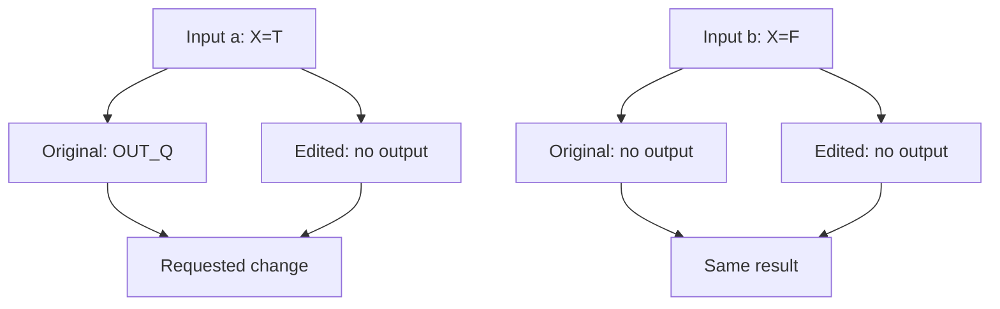
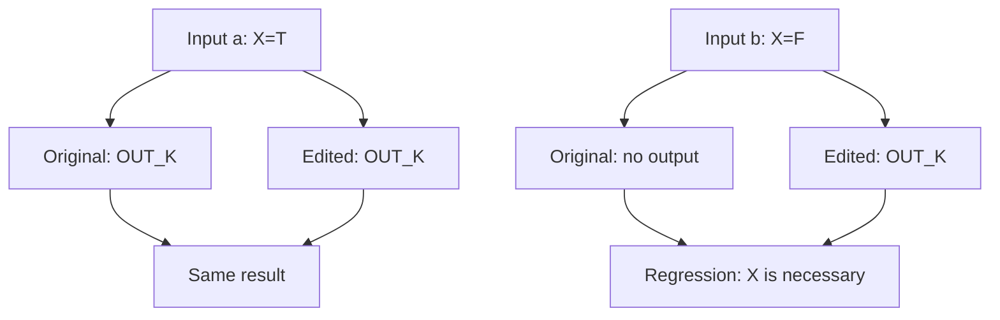

# Behavior Test Reference

A strong test is a real probe of one **independently-failable observable outcome** through the Interface of the Module that owns it, called with its production caller's setup, or the externally observable state governed by that Interface; a test runner or CI result alone establishes no coverage.

A behavior test survives internal refactoring: if observable behavior is unchanged but the test breaks, the test is coupled to implementation. Several assertions are valid when they jointly prove one behavior; one assertion can still hide an over-broad behavior.

Comparison probes need not be committed. Keep an uncommitted probe at a
test path (for example `tests/probe_intent.py`) until pass completion; the
runner refuses non-test paths as production overlays. A test runner names its
cases. A direct operation must print one `name: result` line per case and also
check its results: an assertion alone names no case, and exit 0 alone proves nothing.

Commit a probe only for regression coverage no existing check has, as the
smallest case calling that owner. Additional checks
require distinct coverage, with defect sensitivity
and no narrowing of the contract; they do not replace production acceptance. Apply
[Production Code's comparison rules](../production-code/SKILL.md#minimum-implementation-decision)
for N/N+1 proof and conditional A/B measurements.

## What the batch must prove

| Case | Proof shape |
|---|---|
| Atomic behavior | One outcome under one relevant precondition; split outcomes that different defects could break independently. |
| Complete failure contract | Expected error or refusal, the observable state required by the contract, and the correct outward result, exit status, or propagated exception. |
| Touched-Seam preservation | A rerouted public operation retains each material success, failure, input-form, state, and atomicity guarantee the new path can alter. |
| Architecture falsifier | A reachable semantic bypass challenges a load-bearing mechanism or state boundary, not merely its obvious spelling. A passing probe is regression evidence, not a manufactured failure. |
| Interaction slice | One behavior cannot mutate state or invalidate a guarantee owned by another through shared state, lifecycle, ordering, or a touched Seam. |
| Differential | The same inputs decided in both evaluation systems agree, or the divergence is recorded with the system whose rules decide. One input per type class the Seam admits, never only the task's examples. |

## MC/DC

This requirement extends standard MC/DC. One independence pair for each condition is not sufficient.

A **decision** is a Boolean expression that controls a branch, guard, ternary, filter or return. A **condition** is one atomic operand. A repeated condition, one that occurs more than once in a decision, is one condition: vary all its occurrences together.

An **MC/DC independence pair** is two executable test cases whose inputs change one condition and change the original decision, or the edited decision for a condition the edit adds. The other conditions keep the same values (unique cause), or differ only where they cannot affect the decision (masking). A short-circuited operand is don't-care. Coupled conditions cannot vary independently: use a masking pair, or show the context cannot be reached.

**A pair is test code that runs. A list, table, plan or description of a pair is not a pair and counts for nothing.**

A **decisive context** is a combination of the other values that permits this independent change. Assignments that differ only in masked operands are one context. Contexts that produce different outcomes are different contexts, even when the decision is true in both.

### Procedure

1. Find every decision your edit changes; each of its conditions, kept ones included, needs pairs. Rewording a condition without changing its decision creates no obligation.
2. Use the original code to find **EVERY feasible decisive context**. For an added condition, use the contexts of the edited decision and compare both inputs with the original result.
3. Write an MC/DC independence pair for each context as two executable test cases in your direct batch, labelled `<condition> | <context> | a` and `... | b`, each asserting its exact result. A pair covers only its own context. Name both cases in the owning map item's `boundaryInputs`.
4. Put the pairs in your existing direct batch. A batch without required pairs is incomplete, even if all its tests pass.
5. Run the same batch on the original code and the edited code. Use the same initial state for each test.
6. For each input in each pair, assert that the edited result **EQUALS** the original result. Do not use subset checks. If the request names an exact change, assert that expected result instead. Rewriting the expected value or the formula that computes it is the same as changing it.
7. Find every pair where the original decision flips and the edited decision does not. Treat each as a regression unless the request names that exact change. When a pair fails after your edit, do not change its expected value to make it pass. Fix the code. A sentence that tells you to keep existing behaviour never authorises a change to existing behaviour; it requires the original result. If you believe the request needs the new result, ask the user.
8. Run the batch again.
9. Send the corrected code and test results to review only after the receipt's `open` list is empty.

**Do not use tests for a requested change as evidence that another context keeps its original behavior.**

### Example

Request: stop the `OUT_Q` output. Keep the original behavior for `OUT_K`.

```text
ORIGINAL                              EDITED
if P and X and (K or Q):               if P and K:
    emit(OUT_K if K else OUT_Q)            emit(OUT_K)
```

The edit also removes `X`. Each diagram shows both inputs on both versions. “No output” means no emission.

#### Pair 1: requested change

Context: `P=T, K=F, Q=T`.



This pair shows the requested change. It does not show the regression in Pair 2.

#### Pair 2: regression

Context: `P=T, K=T`; `Q` is masked.



Input `b` shows the regression. The correct code is:

```text
if P and X and K:
    emit(OUT_K)
```

When `K=T`, `K or Q` is true and the output is `OUT_K` whatever `Q` is, so `Q=F` and `Q=T` are one context; choose either. `X` has two decisive contexts: `(P,K,Q)=(T,F,T)` and `(T,T,-)`. Do not merge them: they produce different outcomes (`OUT_Q` and `OUT_K`).

#### Pair 3: requested change for `Q`

Context: `P=T, X=T, K=F`. Input `Q=T` gives `OUT_Q` on the original and no output on the edited code; input `Q=F` gives no output on both. The edit removed `Q` too, so `Q` needs this pair of its own.

The batch is complete only when every changed condition has a pair in each of its decisive contexts: here `X` twice and `Q` once.

### Context completeness

The runner enforces each declared case: it must execute and carry its item's outcome. The runner does not derive the required contexts, and it does not check that a pair is independent. You derive every feasible context from the original decision and the diff; the preflight advisor and final review check your list.

- Match pairs by **condition AND decisive context**, including contexts for retained outcomes.
- Count a pair only if its executions show an original decision flip (the edited decision for an added condition) in that exact context. Establish the condition values from execution or independently checked fixture facts, never from labels.
- An infeasible context needs executed evidence: a case under the context's own names drives the Interface and shows the constraint on both trees. State the reason in the item's `expected`. Do not treat unknown contexts as infeasible.
- Keep short-circuit evaluation. Make sure that the target condition executes. Make sure that each input has the required context. Do not evaluate an unsafe skipped operand.
- If only the other input supplies a context value, mark that value as unverified. Unavailable measurement is not unreachable input: print `<case>: unverified - <why>`, and the item stays open.
- Do not close TDD with missing contexts, unverified contexts, or differences that the request does not permit.

### Values and effects

For each changed path that produces values, add applicable boundary tests.
Include zero, one, and several results where applicable.
Assert the actual contents and effects.
Assert the absence of output where applicable.

Use the existing probes and batch results.

## Attribution

A historical failure must reach the claimed behavior. Collection, imports, setup errors and zero tests cannot demonstrate a product regression. A rollback probe stopping at a missing API proves no rollback behavior; create the Interface and exercise its guarantees independently.

Assert meaningful public outputs and state effects with real collaborators. For a rejected transfer, assert the error, unchanged independently read balances and uncommitted result. Keep every independently falsifiable obligation covered. The runner executes the same assertions on each source version; existing review checks whether those assertions express the original objective.

## Observable state

Verify through the owner's Interface or the externally observable state governed by that Interface. Do not inspect an internal store merely because it is convenient. Direct state inspection is valid when the state itself is a public product artifact, or when the Interface explicitly promises its exact persisted state.

Avoid tests that:

- replace production collaborators with programmed answers;
- assert private methods, call counts, or interior sequencing instead of behavior;
- fail because setup, syntax, collection, fixture shape, or a missing API prevents the mapped Seam from being reached;
- combine independently-failable outcomes under one broad name;
- prove only the happy path while omitting declared failure or preservation behavior;
- inspect private persistence when the public contract does not expose or govern it.
